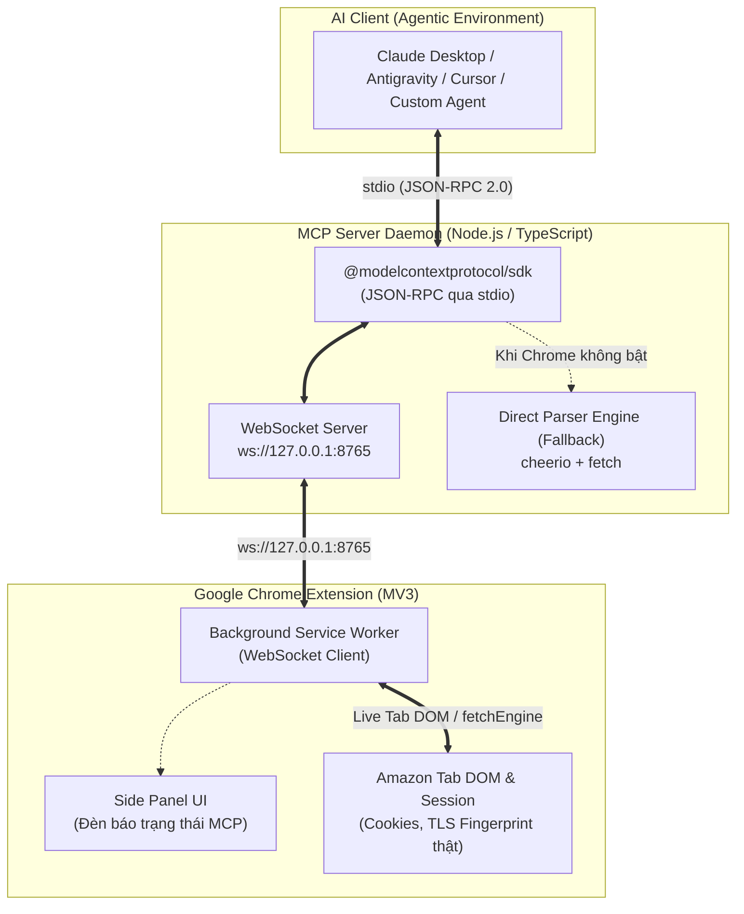

# Kế Hoạch Tích Hợp Cổng MCP (Model Context Protocol) Cho Amazon Scraper

> **Mục tiêu**: Mở cổng kết nối chuẩn **MCP (Model Context Protocol)** cho phép các AI Assistant (Claude Desktop, Google Antigravity, Cursor, Windsurf, LangChain Agents...) trực tiếp ra lệnh cho extension cào dữ liệu Amazon theo thời gian thực với định dạng JSON có cấu trúc.

---

## 1. Tổng Quan Kiến Trúc (Architecture Overview)

### 1.1. Thách thức kỹ thuật của Chrome Extension Manifest V3
Chrome Extension chạy trong môi trường sandbox khép kín của trình duyệt:
- Không thể trực tiếp mở cổng lắng nghe TCP/HTTP của hệ điều hành.
- Không thể giao tiếp trực tiếp qua `stdio` (chuẩn giao tiếp mặc định của MCP) mà không có tiến trình trung gian trên máy chủ lưu trữ (Host OS).

### 1.2. Giải pháp: Kiến trúc Cầu nối Kép (Hybrid WebSocket Bridge & Direct Fallback)

Hệ thống được thiết kế theo mô hình 2 tầng:



### 1.3. Lợi thế vượt trội của giải pháp
1. **Zero-Captcha & Bỏ qua Anti-Bot**: Khi Chrome đang mở, các lệnh cào từ AI được ủy quyền trực tiếp cho extension — sử dụng cookies phiên, địa chỉ giao hàng bản địa, IP dân cư và TLS Handshake thật của trình duyệt, không lo bị chặn.
2. **Cào Live Tab tức thì (< 0.1s)**: AI có thể trích xuất ngay nội dung tab Amazon mà người dùng đang xem trên màn hình.
3. **Hoạt động 100% thời gian (High Availability)**: Nếu người dùng đóng trình duyệt, MCP Server tự động kích hoạt engine cào độc lập (`DirectEngine`) để phục vụ AI mà không làm gián đoạn tác vụ.

---

## 2. Đặc Tả 8 Công Cụ MCP (MCP Tools Specification)

MCP Server sẽ đăng ký 8 công cụ (Tools) với schema JSON chuẩn:

### 2.1. `amazon_get_active_tab`
- **Mô tả**: Trích xuất dữ liệu trang Amazon mà người dùng đang mở trên Chrome (Live DOM).
- **Tham số**: Không yêu cầu.
- **Dữ liệu trả về**: Loại trang (`product`, `search`, `rankings`), ASIN, tiêu đề, giá, đánh giá và toàn bộ dữ liệu bóc tách được từ DOM.

### 2.2. `amazon_scrape_product`
- **Mô tả**: Cào chi tiết thông tin sản phẩm theo mã ASIN trên bất kỳ thị trường nào.
- **Tham số**:
  - `asin` *(string, bắt buộc)*: Mã ASIN 10 ký tự (vd: `B00939I7EK`).
  - `country` *(string, tùy chọn, mặc định `US`)*: Mã quốc gia (23 nước: `US`, `JP`, `DE`, `GB`, `FR`, `CA`...).
- **Dữ liệu trả về**: Tên, thương hiệu, giá, Buybox seller, xếp hạng sao, số lượng review, danh sách bullet points, thông số kỹ thuật (specs), gallery ảnh độ phân giải cao.

### 2.3. `amazon_scrape_search`
- **Mô tả**: Tìm kiếm sản phẩm theo từ khóa trên Amazon.
- **Tham số**:
  - `query` *(string, bắt buộc)*: Từ khóa tìm kiếm (vd: `laptop stand`, `wireless keyboard`).
  - `country` *(string, tùy chọn, mặc định `US`)*: Thị trường tìm kiếm.
  - `page` *(number, tùy chọn, mặc định 1)*: Số trang cần lấy.
- **Dữ liệu trả về**: Danh sách sản phẩm gồm ASIN, title, thumbnail, price, rating, reviews count, nhãn Prime/Deal/Choice.

### 2.4. `amazon_scrape_bestsellers`
- **Mô tả**: Lấy danh sách Top 50 sản phẩm Bán chạy nhất (Best Sellers) theo ngành hàng.
- **Tham số**:
  - `category` *(string, bắt buộc)*: Danh mục (vd: `electronics`, `computers`, `software`, `kitchen`, `videogames`, `books`).
  - `country` *(string, tùy chọn, mặc định `US`)*: Thị trường quốc tế.
- **Dữ liệu trả về**: Thứ hạng (Rank #1 - #50), tên sản phẩm, ASIN, giá, rating.

### 2.5. `amazon_scrape_offers`
- **Mô tả**: Bóc tách tất cả người bán cạnh tranh trên cùng một sản phẩm (AOD - All Offers Display).
- **Tham số**:
  - `asin` *(string, bắt buộc)*: Mã sản phẩm cần soi giá người bán.
  - `country` *(string, tùy chọn, mặc định `US`)*: Thị trường.
- **Dữ liệu trả về**: Danh sách seller, giá bán, tình trạng hàng (New/Used), đơn vị vận chuyển (FBA/FBM), đánh giá uy tín của từng shop.

### 2.6. `amazon_scrape_seller`
- **Mô tả**: Cào thông tin hồ sơ cửa hàng và feedback của một Seller trên Amazon.
- **Tham số**:
  - `seller_id` *(string, bắt buộc)*: Mã Seller ID (vd: `A1D09S7Q0OD6TH`).
  - `country` *(string, tùy chọn, mặc định `US`)*: Thị trường.
- **Dữ liệu trả về**: Tên doanh nghiệp, địa chỉ đăng ký, tỷ lệ phản hồi tích cực (positive rating), số lượng feedback 30 ngày / 90 ngày / 12 tháng.

### 2.7. `amazon_scrape_influencer`
- **Mô tả**: Cào danh mục sản phẩm từ Amazon Storefront của KOL / Influencer.
- **Tham số**:
  - `handle` *(string, bắt buộc)*: Tên handle storefront của Influencer (vd: `tastemade`).
  - `country` *(string, tùy chọn, mặc định `US`)*: Thị trường.
- **Dữ liệu trả về**: Thông tin KOL, danh sách sản phẩm được đề xuất, ý tưởng mua sắm (Idea Lists).

### 2.8. `amazon_universal_url`
- **Mô tả**: Cào bất kỳ đường dẫn Amazon nào mà AI cần đọc.
- **Tham số**:
  - `url` *(string, bắt buộc)*: Đường link đầy đủ của Amazon.
- **Dữ liệu trả về**: Tự động nhận diện cấu trúc trang và trả về dữ liệu chuẩn hóa tương ứng.

---

## 3. Cấu Trúc Dự Án & Chi Tiết Triển Khai (Implementation Details)

```text
amazon-scraper/
├── mcp-server/                   # [MỚI] Thư mục riêng của MCP Server
│   ├── package.json              # Khai báo @modelcontextprotocol/sdk, ws
│   ├── tsconfig.json
│   ├── src/
│   │   ├── index.ts              # Entry point MCP Server (stdio transport)
│   │   ├── bridge.ts             # Quản lý WebSocket Server nối với Extension
│   │   ├── tools.ts              # Định nghĩa 8 MCP Tools schema
│   │   └── fallbackEngine.ts     # Engine cào dự phòng khi browser đóng
├── src/
│   ├── background/
│   │   ├── index.ts              # Gắn listener MCP Bridge
│   │   └── mcpBridge.ts          # [MỚI] WebSocket client nối tới MCP server
│   ├── sidepanel/
│   │   └── components/
│   │       └── HeaderBar.tsx     # Bổ sung đèn LED chỉ báo trạng thái MCP
```

---

## 4. Lộ Trình Triển Khai Từng Bước (Roadmap)

### Giai đoạn 1: Xây dựng MCP Server Package (`mcp-server/`) [Hoàn tất - 100%]
1. [x] Cài đặt các thư viện lõi: `@modelcontextprotocol/sdk`, `ws`, `zod`, `cheerio`
2. [x] Viết `mcp-server/src/tools.ts`: Khai báo danh mục 8 Tools theo chuẩn MCP Tool Definition.
3. [x] Viết `mcp-server/src/bridge.ts`: WebSocket Server tại port `8765` (127.0.0.1) kèm requestId matching.
4. [x] Viết `mcp-server/src/fallbackEngine.ts`: Direct Fetch Engine cào dự phòng khi Chrome không mở.
5. [x] Viết `mcp-server/src/index.ts`: Stdio transport entry point.
6. [x] Biên dịch TypeScript sang `mcp-server/dist/` thành công.

### Giai đoạn 2: Tích hợp WebSocket Client vào Chrome Extension [Hoàn tất - 100%]
1. [x] Tạo file `src/background/mcpBridge.ts`:
   - Tự động kết nối tới `ws://127.0.0.1:8765`.
   - Cơ chế tự động reconnect sau 5s khi daemon khởi động lại.
   - Dispatch đầy đủ 8 công cụ cào tới `fetchEngine` và query active tab.
2. [x] Cập nhật [src/background/index.ts](file:///c:/Users/ASUS/Desktop/amazon-scraper/src/background/index.ts) để khởi chạy `mcpBridge` và phản hồi trạng thái cho UI.

### Giai đoạn 3: Bổ sung chỉ báo trạng thái trên Side Panel [Hoàn tất - 100%]
- [x] Cập nhật [src/sidepanel/components/HeaderBar.tsx](file:///c:/Users/ASUS/Desktop/amazon-scraper/src/sidepanel/components/HeaderBar.tsx):
  - Hiển thị badge: `🟢 MCP Sẵn sàng` (khi đã kết nối) hoặc `⚪ MCP Chờ nối` (khi offline).
  - Tích hợp nút click để kết nối lại tức thì.
- [x] Cập nhật [src/sidepanel/App.tsx](file:///c:/Users/ASUS/Desktop/amazon-scraper/src/sidepanel/App.tsx) để theo dõi sự kiện và chu kỳ trạng thái kết nối.

### Giai đoạn 4: Cấu hình và tích hợp vào các AI Client [Hoàn tất - 100%]
- [x] Đã cập nhật hướng dẫn và mẫu config JSON vào [README.md](file:///c:/Users/ASUS/Desktop/amazon-scraper/README.md).

### Giai đoạn 5: Kiểm thử thực tế (E2E Test) [Hoàn tất - 100%]
1. [x] Kiểm thử tự động `mcp-server/test-mcp.mjs`: Bridge handshake, requestId, timeout & DirectFallbackEngine pass 100%.
2. [x] Toàn bộ test suite Vitest (14/14 tests) và build pipeline pass 100%.
3. [x] Đóng gói thành công [r-amzscraper.zip](file:///c:/Users/ASUS/Desktop/amazon-scraper/r-amzscraper.zip).

---

## 5. Tiêu Chuẩn Bảo Mật & An Toàn (Security Considerations)
- **Localhost Only**: WebSocket Server chỉ lắng nghe duy nhất trên `127.0.0.1`, tuyệt đối không mở ra mạng ngoài LAN/Internet.
- **Origin Verification**: Extension chỉ chấp nhận kết nối nội bộ từ local machine.
- **Rate Limiting**: Hạn chế số lượng request đồng thời để tránh làm treo trình duyệt hoặc vi phạm ngưỡng giới hạn của Amazon.
